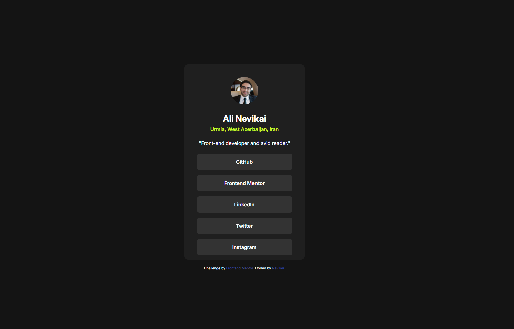

# Frontend Mentor - Social Links Profile Solution

This is a solution to the **Social Links Profile** challenge on [Frontend Mentor](https://www.frontendmentor.io).
Frontend Mentor challenges help developers improve their skills by building realistic, hands-on projects.

---

## 📋 Table of Contents

- [Overview](#overview)
  - [The Challenge](#the-challenge)
  - [Screenshot](#screenshot)
  - [Links](#links)
- [My Process](#my-process)
  - [Built With](#built-with)
  - [What I Learned](#what-i-learned)
  - [Continued Development](#continued-development)
- [Project Structure](#project-structure)
- [Useful Resources](#useful-resources)
- [Author](#author)

---

## 🔍 Overview

### The Challenge

Users should be able to:

- View a centered profile card layout
- See hover and **focus-visible** states for all interactive elements
- Experience a simple, accessible, and clean UI

---

### 📸 Screenshot

---

### 🔗 Links

- **Solution URL:** _Frontend Mentor solution link_
- **Live Site URL:** _Live demo link_

---

## ⚙️ My Process

### Built With

- Semantic **HTML5**
- **CSS** (custom properties)
- **Flexbox**
- Mobile-first workflow
- Accessibility-focused markup

---

### What I Learned

This project was a valuable step forward in my frontend journey.
While working on this challenge, I learned:

- How to **center a card component** perfectly using CSS
- How to use the `:focus-visible` pseudo-class to improve keyboard accessibility
- How to write **more accessible HTML** using semantic elements
- The importance of hover and focus states for better user experience

Overall, this challenge helped reinforce fundamental layout and accessibility concepts and pushed me one step forward as a frontend developer.

---

### Continued Development

In future projects, I would like to:

- Improve color choices using more modern design systems
- Refactor and optimize CSS for better scalability
- Write cleaner and more professional code
- Explore more advanced accessibility techniques

---

## 📁 Project Structure

social-link-profile/
│
├── assets/
│ ├── images/
│ └── style.css
│
├── index.html
├── README.md
└── .gitignore

---

## 📚 Useful Resources

- [W3Schools](https://www.w3schools.com)
  Helped me review HTML and CSS fundamentals quickly.

- [ChatGPT](https://chat.openai.com)
  Used for debugging issues and understanding better solutions during development.

---

## 👤 Author

- **Frontend Mentor:** _your-username_
- **GitHub:** _your-github-profile_
- **LinkedIn / Website:** _optional_

---

⭐ *This project was a great learning experience and a solid practice for improving layout, accessibility, and clean HTML/CSS structure.*
